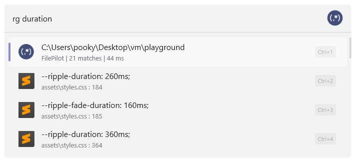

<div align="center">
  <picture>
    <source media="(prefers-color-scheme: dark)" srcset=".github/readme_for_dark_theme.svg">
    <source media="(prefers-color-scheme: light)" srcset=".github/readme_for_light_theme.svg">
    
  </picture>
</div>

<p align="center">
  
  
  
  
</p>

## GrepFlow: [ripgrep](https://github.com/BurntSushi/ripgrep) plugin for [Flow Launcher](https://www.flowlauncher.com/)

<p align="center"></p>

Runs [ripgrep](https://github.com/BurntSushi/ripgrep) in the **folder or workspace of the file manager/code editor you last used** and shows the matching lines directly in the launcher.


### Supported apps

**File managers**
- [Files](https://github.com/files-community/Files)
- [File Pilot](https://filepilot.tech/) - recommended
- [Total Commander](https://www.ghisler.com/)
- [Windows Explorer](https://support.microsoft.com/en-us/windows/experience/fileexplorer/file-explorer-in-windows)

**Code editors**
- [Android Studio](https://developer.android.com/studio)
- [Cursor](https://www.cursor.com/)
- [IntelliJ IDEA](https://www.jetbrains.com/idea/)
- [PyCharm](https://www.jetbrains.com/pycharm/)
- [Sublime Text](https://www.sublimetext.com/)
- [Visual Studio](https://visualstudio.microsoft.com/)
- [VS Code](https://code.visualstudio.com/)
- [Zed](https://zed.dev/)

**CMD**
- [Claude Code](https://github.com/anthropics/claude-code)
- [Codex CLI](https://github.com/openai/codex)


### Usage

```
rg [text]
```

The first row shows which folder is being searched and how many matches were found, selecting it opens that folder. Every other row is one matching line - selecting it opens the file.

Search options can be passed after ` -- `:

```
rg TODO -- -g *.cs
```

GrepFlow accepts only these search-scoping and matching options:

- `-F`, `--fixed-strings`
- `-i`, `--ignore-case`, `-s`, `--case-sensitive`, `-S`, `--smart-case`
- `-w`, `--word-regexp`, `-x`, `--line-regexp`
- `-g`, `--glob`, `--iglob`
- `-t`, `--type`, `-T`, `--type-not`
- `--hidden`, `--no-ignore`

If `rg` is not found, GrepFlow will offer to install it from the official [ripgrep repository](https://github.com/BurntSushi/ripgrep/releases/tag/15.2.0). It is installed at `...AppData\Roaming\FlowLauncher\Settings\Plugins\GrepFlow\rg\rg.exe`

### Installation

Type `pm install GrepFlow by keekys` in Flow Launcher

### Check out my other plugins

- [SteamFlow](https://github.com/keekyslusus/SteamFlow)
- [GoogleKeepFlow](https://github.com/keekyslusus/GoogleKeepFlow)